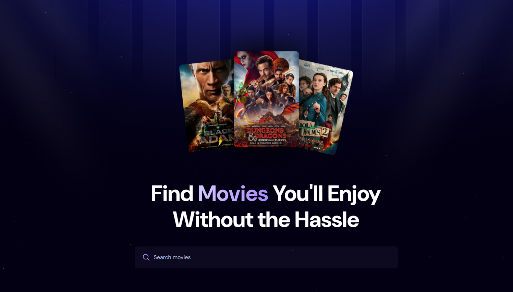
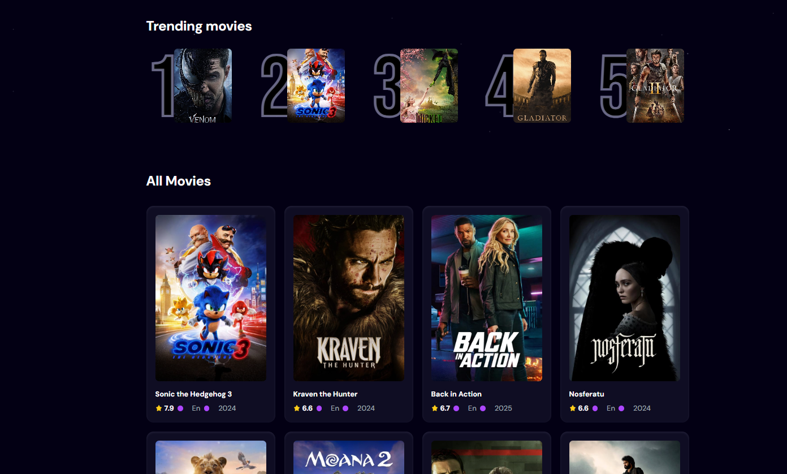

# <a href="https://youtu.be/dCLhUialKPQ?si=yTqN89-O7X32jjpU">React JS 19 Full Course 2025</a>

<u><i><a href="https://susannainkilainen.github.io/ReactMovieApp/">Live Demo</a></i></u>

<ul>
<li>React + Vite</li>
<li><a href="https://flowbite.com/docs/getting-started/introduction/">Tailwind CSS</a></li>
<li><a href="https://cloud.appwrite.io/">Appwrite</a> </li>
<li>API (<a href="https://www.themoviedb.org/">TMBD API</a>)</li>
</ul>

# Movie Application
A simple but instructive exercise.

# Features
<ul>
<li>Browse all movies</li>
<li>Search specific movies</li>
<li>Trending movies algorithm</li>
<li>Responsive</li>
</ul>

